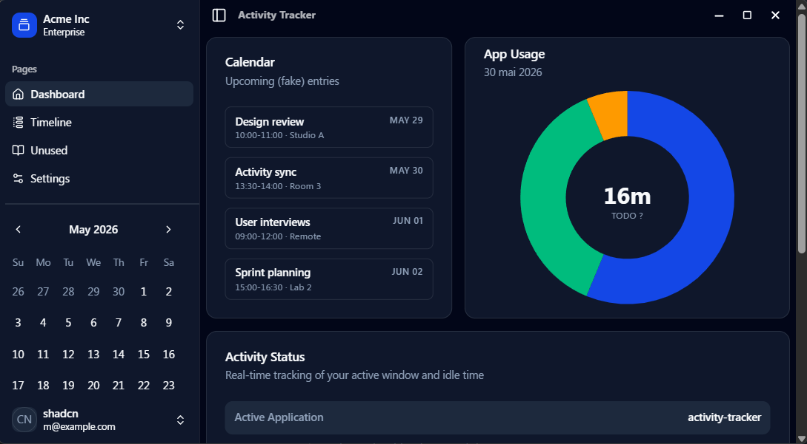

# Activity Tracker

Desktop activity tracking app with a SvelteKit UI and a Tauri backend.

<p align="center">
	
	
	
	
	
</p>

## Screenshots

<p align="left">
	
	<!-- 
	 -->
</p>

## Tech Stack

- Tauri 2 (Rust)
- SvelteKit (Svelte 5) + Vite
- TypeScript
- DuckDB (local activity store)
- Tailwind CSS v4 + shadcn-svelte/bits-ui components

## Development

```bash
npm install
npm run dev
```

## Desktop App (Tauri)

```bash
npm run tauri dev
```

## Build

```bash
npm run build
npm run tauri build
```

## Type Check

```bash
npm run check
```

## Project Structure

- `src/` SvelteKit app
- `src-tauri/` Tauri (Rust) backend